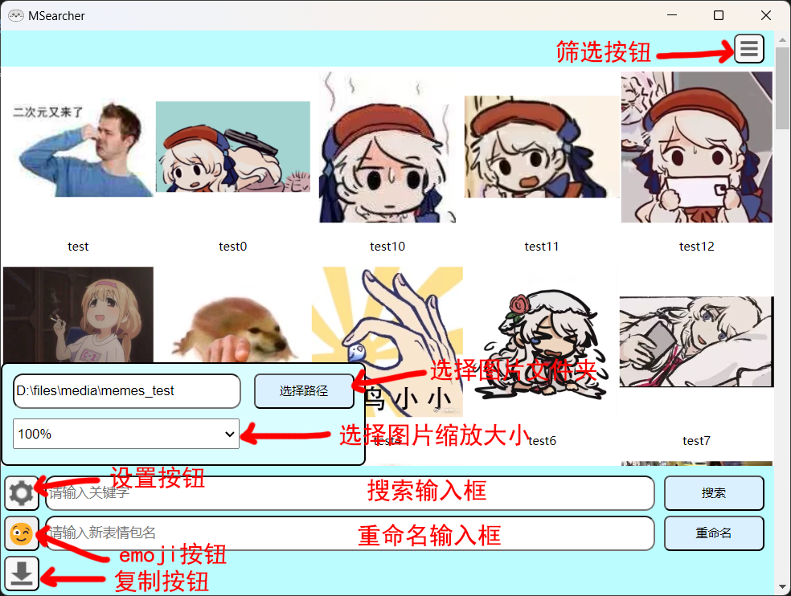

    

# MSearcher

    
    
    
    

## 目录

* [写在前面](#写在前面)
* [功能](#功能)
* [安装与更新](#安装与更新)
* [操作说明](#操作说明)
* [卸载](#卸载)
* [寄语](#寄语)
* [新版本更新内容](#新版本更新内容)

## 写在前面

这是一个非常简陋的项目，只是让你可以快速地根据图片名称搜索到对应的图片而已（还可以重命名图片）。

本来是想写一个安卓APP，结果用electron写完后才发现不能打包成apk，尝试了cordova和Android Studio，都无法在短时间内完成程序的移植，也无法达到预期的效果，暂时放弃了。

## 功能

* 可以通过图片名称（无需全名）搜索到对应的图片；
* 可以重命名图片；
* 可以快速复制图片到系统剪贴板（无法复制GIF）。

## 安装与更新

从 [releases](https://github.com/Jacken-Wu/MSearcher/releases) 下载最新版本的安装包，解压并运行 exe 安装即可。

更新同理，解压并运行 exe 覆盖安装即可。

## 操作说明

* 选择图片文件夹：点击设置按钮，然后选择你存放meme图/表情包的文件夹；
* 设置图片显示大小：点击设置按钮，然后选择缩放比例；
* 搜索：在搜索框中输入你要搜索的图片名称（输入关键字即可，关键字可不考虑顺序），按下`回车键`或点击右侧`搜索按钮`；
* 重命名：鼠标左键选中要重命名的图片，在最下方（下方第二个）输入框中输入新的名称，按下`回车键`或点击`重命名按钮`或点击右键菜单栏中的`重命名按钮`，即可重命名图片；
* 批量重命名：`ctrl+鼠标左键`可以选中多个图片，然后重命名即可，文件名后会自动添加从0开始的数字序号；
* 重命名（OCR）：选中图片，点击鼠标右键菜单栏中的`OCR重命名`按钮即可；
* 复制图片：左键选中要复制的图片，点击`右键菜单栏中的复制按钮`，或`左下角的复制按钮`，或按下`ctrl+c`，都可复制图片到系统剪贴板（无法复制GIF）；
* 筛选：点击右上角的筛选按钮，可以选择显示已命名或未命名的图片（通过判断图片名称首字符是否为数字、字母或下划线等来实现）。

## 卸载

* 在安装目录找到 `Uninstall MSearcher.exe` 文件，双击运行即可卸载；
* 卸载完成后，记得删除安装目录和 `C:\Users\<YourUserName>\AppData\Roaming\meme_searcher` 目录。

## 寄语

希望各位都能成为群里最擅长发meme图的崽儿。

~~如果有人能自愿移植安卓就好了~~

## 新版本更新内容

### 1.3.4

log记录程序崩溃信息。

### 1.3.3

新增log功能。

（说来惭愧，之前的版本一直没有log记录。。。）

### 1.3.2

1. 新增繁体简体混合搜索，不用担心简体中文搜索不到繁体中文命名的图片了，反之亦然；
2. 新增英文字母大小写不敏感，搜索时忽略大小写。

### 1.3.1

修复了不能完全退出的bug。

### 1.3.0

1. 新增 OCR 命名功能；
2. 新增命名时的特殊字符检测。

注意：该版本有退出不完全的bug，退出后需在任务管理器中手动结束进程。

### 1.2.0

1. 可以设置图片显示比例了；
2. 优化了底部输入框和按钮的布局；
3. 新增筛选模式为“未命名”时，自动选择第一张未命名图片的功能，方便大量命名时无需鼠标反复点击。

### 1.1.0

1. 为复制和重命名功能添加空检测；
2. 新增鼠标右键菜单；
3. 新增批量重命名功能；
4. 删除鼠标左键复制功能。
