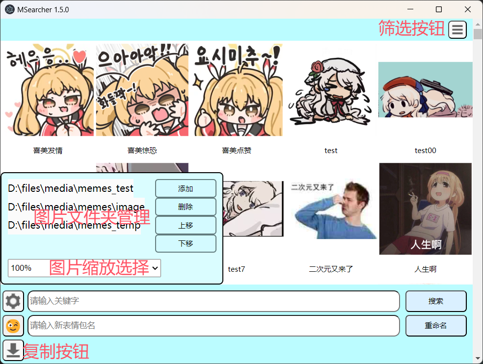

# 如何使用 MSearcher

## 目录

* [界面介绍](#界面介绍)
* [设置](#设置)
  * [选择图片文件夹](#选择图片文件夹)
  * [选择图片缩放大小](#选择图片缩放大小)
* [选择图片](#选择图片)
* [筛选](#筛选)
* [搜索](#搜索)
* [重命名](#重命名)
  * [重命名 / 批量重命名](#重命名--批量重命名)
  * [OCR重命名](#ocr重命名)
  * [以图片现有名字为基础修改名字](#以图片现有名字为基础修改名字)

## 界面介绍

主界面：

右键菜单：

## 设置

点击左下角的`设置按钮`，打开设置页面。

### 图片文件夹管理

点击`添加`按钮，选择你要添加的图片文件夹。

选中左侧文件夹，点击`删除`按钮，可以删除该文件夹；点击`上移`或`下移`按钮，可以调整文件夹的顺序。

### 选择图片缩放大小

点击图片缩放下拉菜单，选择你希望图片缩放的大小。

## 选择图片

点击`鼠标左键`，可以选择单张图片。通过`ctrl+鼠标左键`或`shift+鼠标左键`可以选择多张图片。

## 筛选

点击右上角的筛选按钮，可以打开筛选选项，可以初步筛选已命名/未命名的图片（是根据首字符是否为英文字符来判断的，所以判断不会很准确）。

## 搜索

在下方的搜索输入框中输入你要搜索的关键词，点击`搜索按钮`或按下`回车键`，可以搜索出符合条件的图片。

## 重命名

### 重命名 / 批量重命名

1. 选择图片；
2. 在下方的重命名输入框中输入你要重命名的名称，点击`重命名按钮`或按下`回车键`或点击右键菜单中的`重命名`选项，可以重命名已选中的图片。

### OCR重命名

通过OCR技术自动识别图片中的文字，并将其作为图片的新名称。

1. 选择图片；
2. 点击鼠标右键菜单中的`OCR重命名`选项，可以自动识别已选中的图片中的文字，并自动重命名。

### 以图片现有名字为基础修改名字

点击右键菜单中的`在现有名称上修改名称`选项，可以将已选中的图片的名字复制到重命名输入框中，方便对其进行修改。
